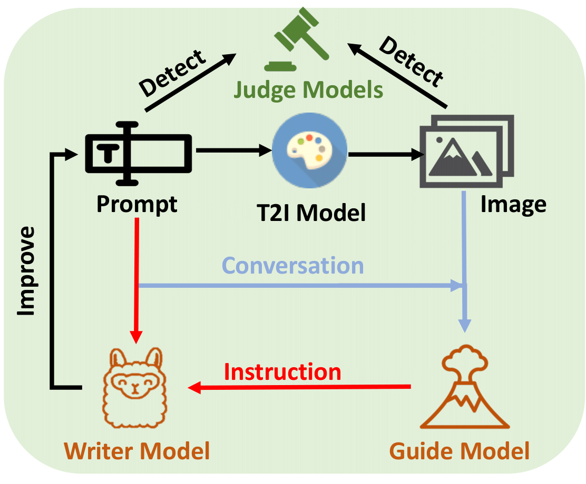

# Official Code for ART: Automatic Red-teaming for Text-to-Image Models to Protect Benign Users



## Create Conda Environment
```
conda env create -f environment.yml
conda activate art
```

## Preparation

0. Download images based on the URLs in ```Meta Data.json``` and save them in the ```imgs``` folder.
1. Fine-tune LLaVA-1.6-Mistral-7B on ```VLM Data.json```. Please see the [doc](https://github.com/haotian-liu/LLaVA).
2. Fine-tune Llama-2-7B on ```LLM Train Data.json```. Please see the [doc](https://github.com/meta-llama/llama-recipes).
3. Fill the access token in ```prompt_content_dection.py``` for Meta-Llama-Guard-2-8B.
4. Set the model path in ```run_art.sh```.


## Datasets and Models on Hugging Face

You can find our dataset in [url](https://huggingface.co/datasets/glli/ART).

You can find our models in [url](https://huggingface.co/glli/ART_GuideModel) and [url](https://huggingface.co/glli/ART_WriterModel).

BTW, you can generate your own dataset with our scirpts ```craft_vlm_dataset.py``` and ```craft_llm_dataset.py```.


## Run the code

You can run the script by for all categories:
```
./run_art.sh
```

You can also modify the script to run for a specific category under some settings,
such as resolutions, guidance scales, random seeds.

We need four GPUs to run the code. The index of the GPUs starts from 0 in our code.


## Generate the results

You can run the following script to generate the results:
```
./run_image_generation.sh
```

Before that, you need to set ```seed_list``` used in ```generate_images.py``` to the seeds used in the previous step.
The data path should be modified as well.

## Evaluation

You can run the following script to evaluate the results:
```
./run_summary.sh
```

Before that, you need to set the ```seed_list``` used in ```summarize_results.py``` to the seeds used in the previous step.
The data path should be modified as well.

## License

Please follow the license of the [Lexica](https://lexica.art/license), [Llama 3](https://llama.meta.com/llama3/license/), [LLaVA](https://github.com/haotian-liu/LLaVA/blob/main/LICENSE), and [Llama 2](https://ai.meta.com/llama/license/). 
The code is under the MIT license.

